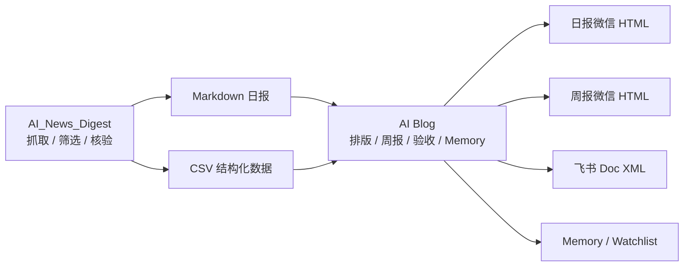
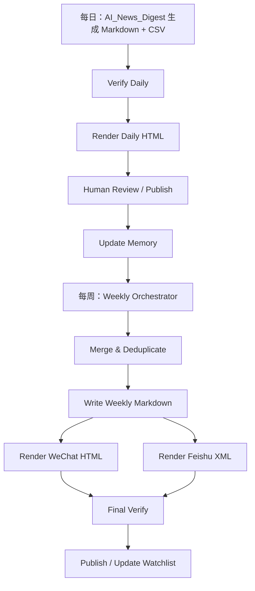
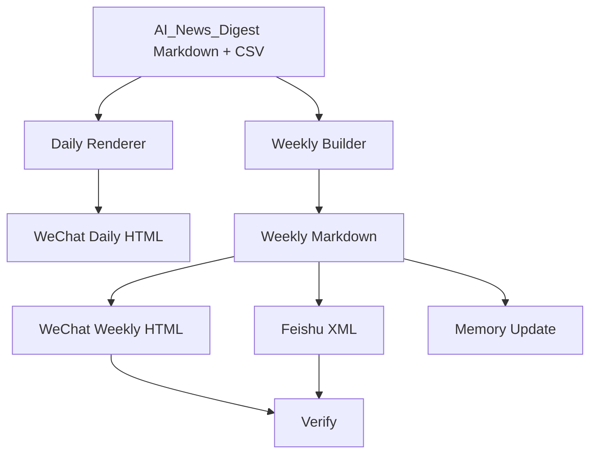

<div align="center">

# AI Blog

**把 AI_News_Digest 生成的日报，变成可发布、可复盘、可持续迭代的内容工作流。**  
**A publishing workflow for turning AI_News_Digest outputs into polished daily and weekly AI briefings.**

[](https://github.com/chengjialu8888/AI_Blog/actions/workflows/verify.yml)
[](https://github.com/chengjialu8888/AI_News_Digest)
[](https://nodejs.org/)
[](#loop-engineering-闭环)

[中文](#中文) · [English](#english) · [快速开始](#快速开始) · [Quick Start](#quick-start)

</div>

---

## 中文

AI Blog 是 [AI_News_Digest](https://github.com/chengjialu8888/AI_News_Digest) 的**发布层**。上游仓库负责抓取、筛选、核验并生成 AI 行业日报；本仓库负责把这些 Markdown/CSV 产物进一步加工成适合发布的日报、周报、微信公众号 HTML 和飞书文档 XML。

它的目标不是再做一个新闻采集器，而是把“每天生成内容”升级成一套可运行的编辑闭环：

- **日报排版**：用既有日报 JSON 模板，把 AI_News_Digest 的 Markdown/CSV 渲染成微信 HTML
- **周报生成**：从一周日报中提炼趋势，不做简单拼接
- **周报排版**：用既有青灰版周报 JSON 模板生成微信 HTML
- **飞书发布**：导出飞书 Doc XML，方便继续进入飞书文档发布流
- **质量验收**：检查 Markdown、CSV、HTML、飞书 XML 的基础结构和链接
- **文件化记忆**：记录已覆盖事件、编辑规则、信源质量和下周观察点

## 目录

- [为什么需要 AI Blog](#为什么需要-ai-blog)
- [它和 AI_News_Digest 的关系](#它和-ai_news_digest-的关系)
- [核心能力](#核心能力)
- [工作流](#工作流)
- [快速开始](#快速开始)
- [常用命令](#常用命令)
- [仓库结构](#仓库结构)
- [Loop Engineering 闭环](#loop-engineering-闭环)
- [模板系统](#模板系统)
- [质量验收](#质量验收)
- [贡献指南](#贡献指南)
- [路线图](#路线图)
- [English](#english)

## 为什么需要 AI Blog

AI 行业日报的难点通常不是“写一篇”，而是**每天都稳定地产出、排版、发布、复盘，并且下周还能接上这周的记忆**。

手工流程很容易卡在几个地方：

| 痛点 | 常见结果 | AI Blog 的做法 |
| --- | --- | --- |
| 日报生成后还要手工排版 | 每天复制粘贴，格式不稳定 | 固化日报 JSON 模板，一条命令生成 HTML |
| 周报容易变成日报合集 | 内容重复，缺少趋势判断 | 从日报中抽取信号，再按趋势重组 |
| 飞书和微信格式分裂 | 同一篇内容要维护多个版本 | 同源 Markdown 同时导出 HTML 和飞书 XML |
| Agent 每次都像第一次工作 | 选题重复，历史判断丢失 | 用 `memory/` 保存已覆盖事件和编辑规则 |
| “看起来完成了”但没人验收 | 链接、标题、结构容易出错 | `verify-report.mjs` 做发布前检查 |

## 它和 AI_News_Digest 的关系

AI Blog 不替代上游新闻引擎。它更像一个内容发布工作台：



## 核心能力

| 能力 | 输入 | 输出 |
| --- | --- | --- |
| 日报渲染 | AI_News_Digest Markdown + CSV | `output/daily/*.html` |
| 周报构建 | 多篇日报 Markdown 或已有周报 Markdown | `output/weekly/*.md` |
| 微信排版 | 日报/周报 Markdown | 微信公众号 HTML |
| 飞书排版 | 周报 Markdown | 飞书 Doc XML |
| 发布验收 | Markdown / CSV / HTML / XML | JSON 验收结果 |
| 记忆更新 | 已发布 Markdown | `memory/covered-events.json` |

## 工作流



## 快速开始

克隆仓库：

```bash
git clone https://github.com/chengjialu8888/AI_Blog.git
cd AI_Blog
```

运行内置样例：

```bash
npm run demo
```

成功后会生成：

- `output/daily/sample-daily.html`
- `output/weekly/sample-weekly.md`
- `output/weekly/sample-weekly.html`
- `output/weekly/sample-weekly.xml`

## 常用命令

### 渲染日报

```bash
npm run daily:render -- \
  --markdown content/daily/ai-daily-YYYY-MM-DD.md \
  --csv content/daily/ai-daily-YYYY-MM-DD.csv \
  --out output/daily/ai-daily-YYYY-MM-DD.html
```

### 从日报目录生成周报草稿

```bash
npm run weekly:build -- \
  --daily-dir content/daily \
  --out-md output/weekly/ai-weekly-draft.md \
  --out-html output/weekly/ai-weekly-draft.html \
  --out-xml output/weekly/ai-weekly-draft.xml
```

### 渲染已有周报

```bash
npm run weekly:build -- \
  --weekly-md content/weekly/ai-weekly-YYYY-MM-DD.md \
  --out-md output/weekly/ai-weekly-YYYY-MM-DD.md \
  --out-html output/weekly/ai-weekly-YYYY-MM-DD.html \
  --out-xml output/weekly/ai-weekly-YYYY-MM-DD.xml
```

### 发布前验收

```bash
npm run verify -- \
  --markdown content/daily/ai-daily-YYYY-MM-DD.md \
  --csv content/daily/ai-daily-YYYY-MM-DD.csv \
  --html output/daily/ai-daily-YYYY-MM-DD.html
```

### 更新记忆

```bash
npm run memory:update -- --markdown content/daily/ai-daily-YYYY-MM-DD.md
```

## 仓库结构

```text
AI_Blog/
├── templates/
│   ├── daily-wechat-template.json
│   └── weekly-wechat-template.json
├── scripts/
│   ├── render-daily.mjs
│   ├── build-weekly.mjs
│   ├── verify-report.mjs
│   ├── update-memory.mjs
│   └── lib/
├── memory/
│   ├── covered-events.json
│   ├── editorial-rules.md
│   ├── source-quality.json
│   └── next-week-watchlist.md
├── prompts/
│   └── weekly-orchestrator.md
├── examples/
├── content/
└── output/
```

## Loop Engineering 闭环

本仓库按照 Loop Engineering 的思想设计：人负责目标和最终判断，Agent/脚本负责重复执行、验收和记忆接力。

| 阶段 | 在 AI Blog 中的落点 |
| --- | --- |
| Goal | 发布一篇结构稳定、来源可追溯、平台可用的日报或周报 |
| Discovery | 读取 AI_News_Digest 产物和 `memory/` |
| Plan | 判断是日报排版、周报聚合还是周报重排版 |
| Execute | 生成 HTML / XML / Markdown |
| Verify | 运行 `npm run verify`，失败则回修 |
| Memory | 更新 `covered-events.json` 和 `next-week-watchlist.md` |

周报允许有限 Open Loop：Orchestrator 可以补充最多 3 条日报之外的趋势候选，但最终必须通过来源、结构和人工复核。

## 模板系统

本仓库内置两套历史使用过的 JSON 模板：

- `templates/daily-wechat-template.json`：每日 AI 速递极简白底排版
- `templates/weekly-wechat-template.json`：公众号推文青灰版排版

这样做的好处是模板不再散落在本地下载目录里，任何人克隆仓库后都可以复现同样的发布格式。

## 质量验收

`scripts/verify-report.mjs` 会检查：

- Markdown 是否包含 H1 标题
- Markdown 是否包含摘要或结论区
- Markdown 是否包含来源链接
- CSV 是否有标题列和 URL 列
- CSV URL 是否为 HTTP(S)
- HTML 是否包含 doctype 和主容器
- 飞书 XML 是否包含 `<title>`

CI 会在每次 push 和 pull request 时运行：

```bash
npm run demo
```

## 贡献指南

欢迎贡献以下内容：

- 新的微信公众号 / 飞书排版模板
- 更强的 Markdown 解析规则
- 更严格的链接和事实验收 gate
- 周报趋势聚类和去重逻辑
- 面向小红书、知乎、网站博客等平台的导出器
- 更完整的示例日报和周报

建议的贡献流程：

1. Fork 本仓库
2. 创建分支：`git checkout -b feature/your-change`
3. 修改并运行：`npm run demo`
4. 提交 Pull Request，并说明你的使用场景和验证结果

## 路线图

- [ ] 增加周报去重报告，展示哪些日报条目被合并
- [ ] 增加链接可达性检查和追踪链接清洗
- [ ] 增加飞书文档一键发布脚本
- [ ] 增加周报头图生成和插入流程
- [ ] 增加多平台导出：知乎、网站博客、小红书
- [ ] 增加 `memory/source-quality.json` 的自动更新逻辑

---

## English

AI Blog is the publishing layer for [AI_News_Digest](https://github.com/chengjialu8888/AI_News_Digest).

The upstream repository collects, filters, verifies and writes AI daily reports. This repository takes those Markdown and CSV outputs and turns them into publishable daily articles, weekly briefings, WeChat-ready HTML, Feishu Doc XML and file-backed editorial memory.

## Why This Exists

Producing one AI news digest is easy. Producing a reliable digest every day, turning it into a weekly narrative, keeping formatting consistent and carrying editorial memory across weeks is the real workflow problem.

AI Blog solves the publishing side:

- render AI_News_Digest Markdown/CSV into daily WeChat HTML
- turn daily reports into weekly trend drafts
- render weekly Markdown into WeChat HTML and Feishu XML
- verify report structure before publishing
- keep persistent editorial memory outside the model context

## Relationship With AI_News_Digest

AI Blog does not replace the news engine. It consumes the upstream artifacts.

| Repository | Responsibility |
| --- | --- |
| [AI_News_Digest](https://github.com/chengjialu8888/AI_News_Digest) | Collect, deduplicate, verify and generate daily AI news Markdown/CSV |
| AI Blog | Render, package, verify, publish and remember editorial state |

## Quick Start

```bash
git clone https://github.com/chengjialu8888/AI_Blog.git
cd AI_Blog
npm run demo
```

The demo writes sample outputs to:

- `output/daily/sample-daily.html`
- `output/weekly/sample-weekly.md`
- `output/weekly/sample-weekly.html`
- `output/weekly/sample-weekly.xml`

## Commands

Render a daily article:

```bash
npm run daily:render -- \
  --markdown content/daily/ai-daily-YYYY-MM-DD.md \
  --csv content/daily/ai-daily-YYYY-MM-DD.csv \
  --out output/daily/ai-daily-YYYY-MM-DD.html
```

Build a weekly draft from daily reports:

```bash
npm run weekly:build -- \
  --daily-dir content/daily \
  --out-md output/weekly/ai-weekly-draft.md \
  --out-html output/weekly/ai-weekly-draft.html \
  --out-xml output/weekly/ai-weekly-draft.xml
```

Render an existing weekly Markdown file:

```bash
npm run weekly:build -- \
  --weekly-md content/weekly/ai-weekly-YYYY-MM-DD.md \
  --out-md output/weekly/ai-weekly-YYYY-MM-DD.md \
  --out-html output/weekly/ai-weekly-YYYY-MM-DD.html \
  --out-xml output/weekly/ai-weekly-YYYY-MM-DD.xml
```

Verify generated outputs:

```bash
npm run verify -- \
  --markdown content/daily/ai-daily-YYYY-MM-DD.md \
  --csv content/daily/ai-daily-YYYY-MM-DD.csv \
  --html output/daily/ai-daily-YYYY-MM-DD.html
```

Update editorial memory:

```bash
npm run memory:update -- --markdown content/daily/ai-daily-YYYY-MM-DD.md
```

## Architecture



## Templates

The repository versions the two JSON templates used in the existing publishing workflow:

- `templates/daily-wechat-template.json`
- `templates/weekly-wechat-template.json`

This makes the publishing style reproducible across machines and contributors.

## Verification

`scripts/verify-report.mjs` checks:

- Markdown title and summary structure
- source links
- CSV title and URL columns
- HTTP(S) URL shape
- HTML doctype and main container
- Feishu XML title block

GitHub Actions runs `npm run demo` on push and pull request.

## Contributing

Useful contributions include:

- new publishing templates
- stronger Markdown parsing
- stricter verification gates
- weekly trend clustering and deduplication
- exporters for more publishing platforms
- richer sample reports

Run this before opening a pull request:

```bash
npm run demo
```

## Notes

Command examples use `YYYY-MM-DD` as a filename placeholder. Replace it with your actual report date or date range when running the workflow.

