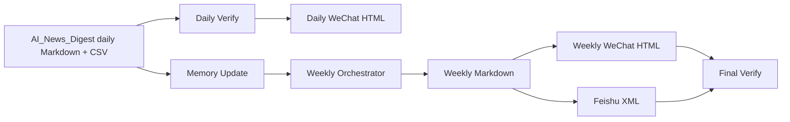

# AI Blog

AI_Blog is the publishing layer for [AI_News_Digest](https://github.com/chengjialu8888/AI_News_Digest).

It does not replace the daily news collection engine. It turns the upstream Markdown/CSV outputs into a looped publishing workflow:

- daily article rendering with the previous daily WeChat JSON template
- weekly article generation and rendering with the previous weekly WeChat JSON template
- Feishu Doc XML export for weekly publishing
- verification gates for Markdown, CSV, HTML and Feishu XML
- file-backed memory for covered events, editorial rules and next-week watchlists

## Workflow



## Repository Layout

```text
AI_Blog/
├── templates/
│   ├── daily-wechat-template.json
│   └── weekly-wechat-template.json
├── scripts/
│   ├── render-daily.mjs
│   ├── build-weekly.mjs
│   ├── verify-report.mjs
│   └── update-memory.mjs
├── memory/
│   ├── covered-events.json
│   ├── editorial-rules.md
│   ├── source-quality.json
│   └── next-week-watchlist.md
├── prompts/
│   └── weekly-orchestrator.md
├── content/
│   ├── daily/
│   └── weekly/
└── output/
    ├── daily/
    └── weekly/
```

## Quick Start

Run the sample pipeline:

```bash
npm run demo
```

Render a daily article from AI_News_Digest output:

```bash
npm run daily:render -- \
  --markdown path/to/ai-daily-YYYY-MM-DD.md \
  --csv path/to/ai-daily-YYYY-MM-DD.csv \
  --out output/daily/ai-daily-YYYY-MM-DD.html
```

Build a weekly article from existing weekly Markdown:

```bash
npm run weekly:build -- \
  --weekly-md content/weekly/ai-weekly-YYYY-MM-DD.md \
  --out-md output/weekly/ai-weekly-YYYY-MM-DD.md \
  --out-html output/weekly/ai-weekly-YYYY-MM-DD.html \
  --out-xml output/weekly/ai-weekly-YYYY-MM-DD.xml
```

Build a weekly draft from multiple daily Markdown files:

```bash
npm run weekly:build -- \
  --daily-dir content/daily \
  --out-md output/weekly/ai-weekly-draft.md \
  --out-html output/weekly/ai-weekly-draft.html \
  --out-xml output/weekly/ai-weekly-draft.xml
```

Verify outputs:

```bash
npm run verify -- \
  --markdown content/daily/ai-daily-YYYY-MM-DD.md \
  --csv content/daily/ai-daily-YYYY-MM-DD.csv \
  --html output/daily/ai-daily-YYYY-MM-DD.html
```

Update memory after a daily or weekly article is accepted:

```bash
npm run memory:update -- --markdown content/daily/ai-daily-YYYY-MM-DD.md
```

## Loop Engineering Notes

The publishing loop is intentionally a closed loop first:

1. **Goal**: publish one daily or weekly article with source links, stable structure and platform-ready formatting.
2. **Discovery**: read upstream Markdown/CSV plus `memory/`.
3. **Plan**: choose whether this run is daily rendering, weekly aggregation or weekly rendering.
4. **Execute**: render Markdown into WeChat HTML and Feishu XML.
5. **Verify**: run `scripts/verify-report.mjs`; failures block publishing.
6. **Memory**: update `memory/covered-events.json` and `memory/next-week-watchlist.md`.

Weekly generation can use a limited open loop: the orchestrator may suggest at most three new trend candidates that were not obvious from the daily reports, but the final article must still pass verification and human editorial review.

## Upstream Contract

AI_News_Digest should provide:

- Markdown report with an H1 title, summary section and source links
- CSV report with title and URL columns
- one file pair per date range

This repo provides:

- daily WeChat HTML
- weekly Markdown
- weekly WeChat HTML
- weekly Feishu XML
- verification trace through command output
- persistent editorial memory

